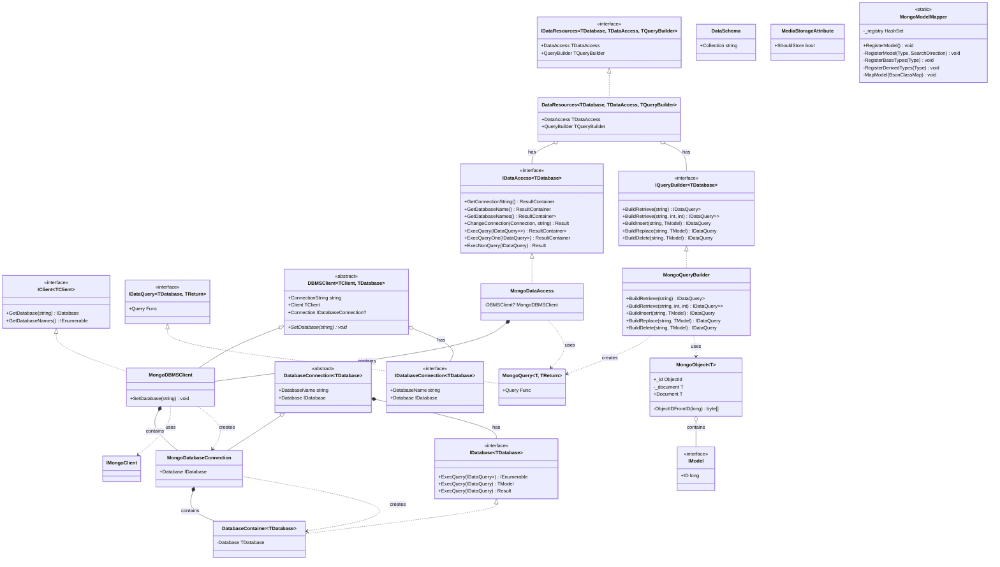

```mermaid
classDiagram
    %% Interface definitions
    class IDatabase~TDatabase~ {
        <<interface>>
        +ExecQuery<T>(IDataQuery<TDatabase, IEnumerable<T>>) IEnumerable<T>
        +ExecQuery<TModel>(IDataQuery<TDatabase, TModel>) TModel
        +ExecQuery<TModel>(IDataQuery<TDatabase, Result>) Result
    }
    
    class IDatabaseConnection~TDatabase~ {
        <<interface>>
        +DatabaseName string
        +Database IDatabase<TDatabase>
    }
    
    class IClient~TClient~ {
        <<interface>>
        +GetDatabase<TDatabase>(string) IDatabase<TDatabase>
        +GetDatabaseNames() IEnumerable<string>
    }
    
    class IDataAccess~TDatabase~ {
        <<interface>>
        +GetConnectionString() ResultContainer<string>
        +GetDatabaseName() ResultContainer<string>
        +GetDatabaseNames() ResultContainer<IEnumerable<string>>
        +ChangeConnection(Connection, string) Result
        +ExecQuery<TModel>(IDataQuery<TDatabase, ResultContainer<IEnumerable<TModel>>>) ResultContainer<IEnumerable<TModel>>
        +ExecQueryOne<TModel>(IDataQuery<TDatabase, ResultContainer<TModel>>) ResultContainer<TModel>
        +ExecNonQuery(IDataQuery<TDatabase, Result>) Result
    }
    
    class IQueryBuilder~TDatabase~ {
        <<interface>>
        +BuildRetrieve<TModel>(string) IDataQuery<TDatabase, ResultContainer<TModel>>
        +BuildRetrieve<TModel>(string, int, int) IDataQuery<TDatabase, ResultContainer<IEnumerable<TModel>>>
        +BuildInsert<TModel>(string, TModel) IDataQuery<TDatabase, Result>
        +BuildReplace<TModel>(string, TModel) IDataQuery<TDatabase, Result>
        +BuildDelete<TModel>(string, TModel) IDataQuery<TDatabase, Result>
    }
    
    class IDataQuery~TDatabase, TReturn~ {
        <<interface>>
        +Query Func<TDatabase, TReturn>
    }
    
    class IDataResources~TDatabase, TDataAccess, TQueryBuilder~ {
        <<interface>>
        +DataAccess TDataAccess
        +QueryBuilder TQueryBuilder
    }
    
    class IModel {
        <<interface>>
        +ID long
    }
    
    %% Abstract and base classes
    class DBMSClient~TClient, TDatabase~ {
        <<abstract>>
        +ConnectionString string
        +Client TClient
        +Connection IDatabaseConnection<TDatabase>?
        +SetDatabase(string)* void
    }
    
    class DatabaseConnection~TDatabase~ {
        <<abstract>>
        +DatabaseName string
        +Database IDatabase<TDatabase>
    }
    
    %% Data classes
    class DataResources~TDatabase, TDataAccess, TQueryBuilder~ {
        +DataAccess TDataAccess
        +QueryBuilder TQueryBuilder
    }
    
    class DataSchema {
        +Collection string
    }
    
    class MediaStorageAttribute {
        +ShouldStore bool
    }
    
    %% MongoDB specific classes
    class MongoDBMSClient {
        +SetDatabase(string) void
    }
    
    class MongoDatabaseConnection {
        +Database IDatabase<IMongoDatabase>
    }
    
    class DatabaseContainer~TDatabase~ {
        -Database TDatabase
    }
    
    class MongoDataAccess {
        -DBMSClient? MongoDBMSClient
    }
    
    class MongoQueryBuilder {
        +BuildRetrieve<TModel>(string) IDataQuery<IMongoDatabase, ResultContainer<TModel>>
        +BuildRetrieve<TModel>(string, int, int) IDataQuery<IMongoDatabase, ResultContainer<IEnumerable<TModel>>>
        +BuildInsert<TModel>(string, TModel) IDataQuery<IMongoDatabase, Result>
        +BuildReplace<TModel>(string, TModel) IDataQuery<IMongoDatabase, Result>
        +BuildDelete<TModel>(string, TModel) IDataQuery<IMongoDatabase, Result>
    }
    
    class MongoQuery~T, TReturn~ {
        +Query Func<IMongoDatabase, TReturn>
    }
    
    class MongoObject~T~ {
        +_id ObjectId
        -_document T
        +Document T
        -ObjectIDFromID(long) byte[]
    }
    
    class MongoModelMapper {
        <<static>>
        -_registry HashSet<Type>
        +RegisterModel<TModel>() void
        -RegisterModel(Type, SearchDirection) void
        -RegisterBaseTypes(Type) void
        -RegisterDerivedTypes(Type) void
        -MapModel(BsonClassMap) void
    }
    
    %% Relationships - Inheritance
    DBMSClient <|-- MongoDBMSClient
    DatabaseConnection <|-- MongoDatabaseConnection
    IDataAccess <|.. MongoDataAccess
    IQueryBuilder <|.. MongoQueryBuilder
    IDataQuery <|.. MongoQuery
    IClient <|.. MongoDBMSClient
    IDataResources <|.. DataResources
    IDatabase <|.. DatabaseContainer
    
    %% Relationships - Composition and Aggregation
    MongoDataAccess *-- MongoDBMSClient : contains
    MongoDBMSClient *-- MongoDatabaseConnection : contains
    MongoDatabaseConnection *-- DatabaseContainer : contains
    MongoObject o-- IModel : contains
    DBMSClient o-- IDatabaseConnection : has
    DataResources o-- IDataAccess : has
    DataResources o-- IQueryBuilder : has
    DatabaseConnection *-- IDatabase : has
    
    %% Usage relationships
    MongoDataAccess ..> MongoQuery : uses
    MongoQueryBuilder ..> MongoQuery : creates
    MongoQueryBuilder ..> MongoObject : uses
    MongoDBMSClient ..> IMongoClient : uses
    MongoDBMSClient ..> MongoDatabaseConnection : creates
    MongoDatabaseConnection ..> DatabaseContainer : creates
```